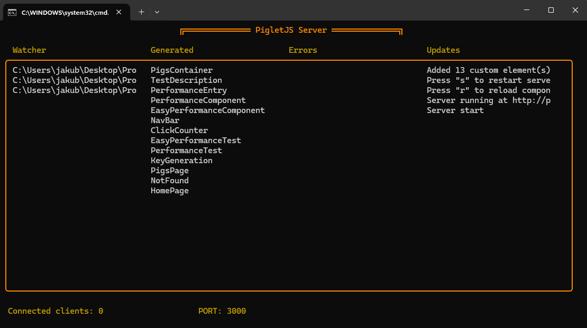

## Asynchronous render callbacks

<p id="top" style="position: absolute; top: -50px"></p>

PigletJS supports asynchronous components, allowing you to load components dynamically when needed.
Currently, I'm developing a feature that will allow to run any asynchronous code in the render callback of a component.
That means you can fetch data, perform calculations, or even `await` for promises directly in the render function of your component. (at top level of the render function)

It is already implemented in the PigletJS core, and you can enable it for the component by using:

```javascript
<script>
  // Enable asynchronous render function for this component "use async"; // Your
  component code here
</script>
```

This directive should be placed at the top of your component file, before any other code. It tells PigletJS to treat the render function as asynchronous.

The problem with this feature is that while it allows you to call asynchronous code in the render function, **the children of the component are not aware of it, thus they will not wait for the asynchronous code to finish before rendering.**
This means that if you have a component that fetches data asynchronously, its children will be rendered immediately, potentially leading to inconsistent states. **They will also not receive attributes on time.**

## Extension styling

Right now web extension theme colors are shades of pink because that was the default color of PigletJS before it was changed to orange.
However, extension colors remain unchanged, which is not very consistent with the rest of the application and will be changed in the future.

Also, there is a little problem with passing property descriptors to the extension - getters are parsed as regular properties, which means that they are not reactive and will not update the application.
That can't really be fixed, because of how data is passed to the extension, but should at least be somehow indicated in the extension UI.

## Custom transition view animations

PigletJS supports custom transition animations for views using [View Transition API](https://developer.mozilla.org/en-US/docs/Web/API/View_Transition_API) with a fallback for browsers that do not support it.
This (aside from looking cool) allows you to create smooth transitions between different views in your application, enhancing the user experience.

However, currently the fallback is hardcoded to a simple fade-in and fade-out effect, which is not very customizable.

When it comes to browsers that support the View Transition API, you can define your own animations using CSS keyframes and apply them to the old and new views during the transition
passing `appContent` as a parameter to the `::view-transition-old` and `::view-transition-new` pseudo-elements:

```css
@keyframes custom-transition-in {
  /* ... */
}

@keyframes custom-transition-out {
  /* ... */
}

::view-transition-old(appContent) {
  animation: custom-transition-out /* ... */;
}

::view-transition-new(appContent) {
  animation: custom-transition-in /* ... */;
}
```

**Note:** This CSS should be added to the root element of your application ([`Pig.html`](Structure#pig-html)), not to individual components.

While this works it is not very flexible, as you have to define the animations in a pretty ugly way, and you cannot change the fallback animation for browsers that do not support the View Transition API.

## Support for index.pig.{ext} files

Currently, detecting `index.pig.{ext}` files is not supported. This means that if you have a file named `index.pig.{ext}` in your project,
PigletJS will not automatically recognize it as a special file for routing or other purposes.

This can lead to a situation where you have a structure like this:

```
src/
  components/
    CustomComponent/
        CustomComponent.pig.mjs
        CustomComponent.pig.html
        CustomComponent.pig.css
```

Which is not really a problem, but it is not the intended way to structure your components.
To address this, PigletJS will be updated to support `index.pig.{ext}` files in the future. This will allow you to create components with a more intuitive structure, like this:

```
src/
  components/
    CustomComponent/
        index.pig.mjs
        index.pig.html
        index.pig.css
```

## Better server status view

At the moment, after starting PigletJS app server statuses are displayed in the console one by one, which can quickly become overwhelming, especially for larger applications.
While it is useful to see the status of each page, it would be better to have a more organized view.

### New UI (Work in progress)



## Customizable NotFound Page

PigletJS allows you to customize the NotFound page by creating a `NotFound.pig.html` file anywhere in your `src/pages` directory.
This file will be used as the 404 page when a user tries to access a route that does not exist in your application.

It works fine, but there are some limitations:

- You can't have multiple NotFound pages for different routes. PigletJS will always use the first `NotFound.pig.html` file it finds in the `src/pages` directory.
- You can't set custom name for the NotFound page. For it to work, the file must be named `NotFound.pig.html`.

It is a simple solution that works well for most cases, but it would be nice to have more flexibility in the future.

## NPM & Chrome Web Store

The only way to install PigletJS right now is to clone the repository and build it yourself.
Same goes for the browser extension - you have to build it yourself and load it as an unpacked extension in your browser.
In the future, PigletJS will be available on NPM and Chrome Web Store, making it easier to install and use.
